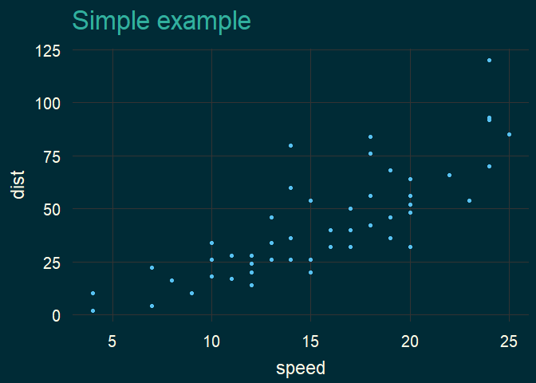

<!-- README.md is generated from README.Rmd. Please edit that file -->

# JSthemes

<!-- badges: start -->
<!-- badges: end -->

The purpose is personal usage. Built from Ricardo Bion’s code for ggtech
package and inspiration from hrbrmstr/hrbthemes and
gadenbuie/xaringanthemer.

## Installation

Development version from [GitHub](https://github.com/) with:

``` r
# install.packages("devtools")
devtools::install_github("JohanSalomonssonSV/JSthemes")
```

## Example

This is a basic example which shows you how to solve a common problem:

``` r
library(tidyverse)
#> -- Attaching packages --------------------------------------- tidyverse 1.3.1 --
#> v ggplot2 3.3.3     v purrr   0.3.4
#> v tibble  3.1.1     v dplyr   1.0.5
#> v tidyr   1.1.3     v stringr 1.4.0
#> v readr   1.4.0     v forcats 0.5.1
#> -- Conflicts ------------------------------------------ tidyverse_conflicts() --
#> x dplyr::filter() masks stats::filter()
#> x dplyr::lag()    masks stats::lag()
library(JSthemes)
```


